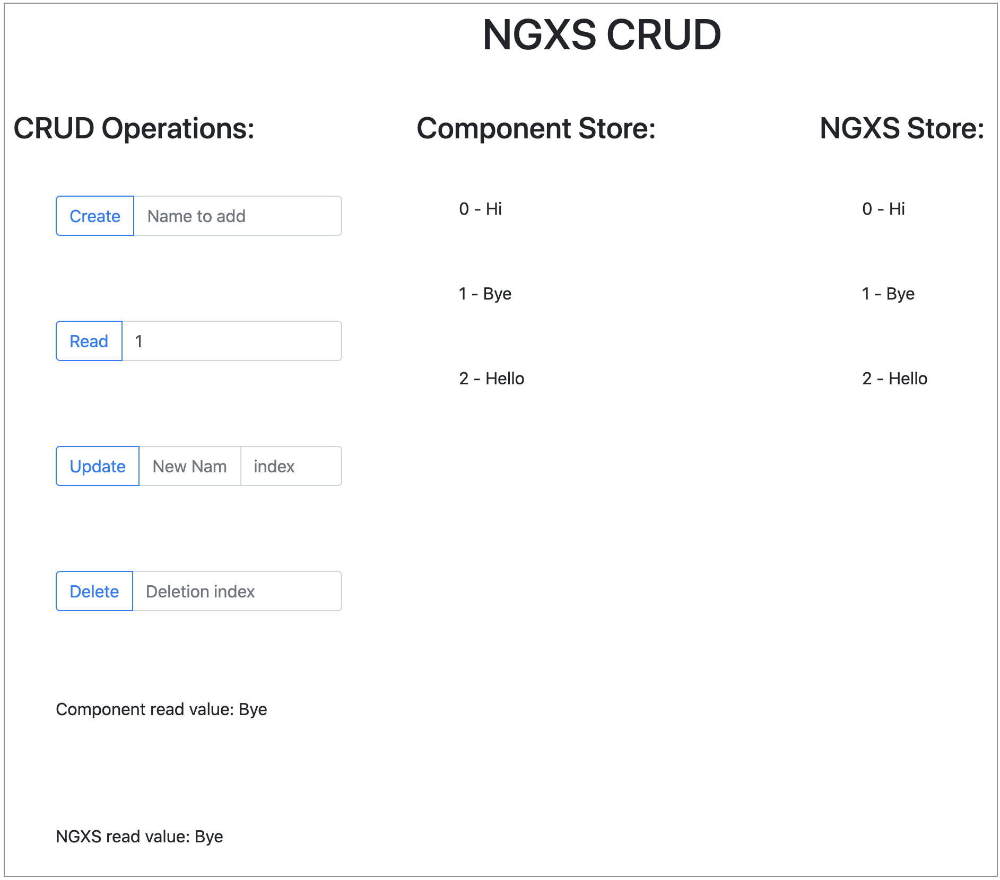

# ngxs-crud

CRUD operations using NGXS in Angular

## Screenshot



## What is this?

Demonstration of Create-Read-Update-Delete operations using the NGXS state management library in Angular. On the left hand side, the data is not persistent and goes back to default on a refresh, on the right hand side, the NGXS library not only stores it in localStorage but also keeps it in an organized manner. We can use time travel debugging because the devtools and logger plugins allow us to see the changes to the data over time!

## Dependencies

```
npm install --save bootstrap
npm install --save jquery
npm install @ngxs/store
npm install @ngxs/logger-plugin --dev
npm install @ngxs/devtools-plugin --dev
npm install @ngxs/storage-plugin --save
```
